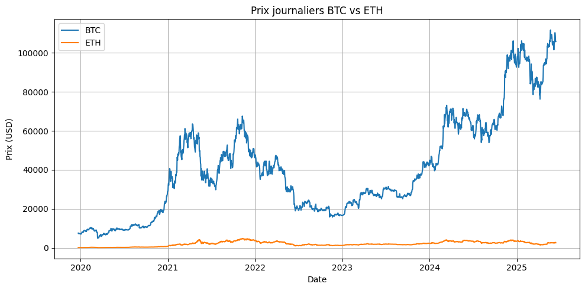

===============================
Analyse Statistique Avancée
===============================

.. raw:: html

   

      
      
      
      
   

.. raw:: html

   

      <h2 style="margin: 0; font-size: 2.5em; font-weight: bold;">📊 Statistiques BTC & ETH</h2>
      
Analyse quantitative comparative des cryptomonnaies majeures

   

Vue d'ensemble
==============

.. raw:: html

   

Cette analyse examine les propriétés statistiques fondamentales de **Bitcoin (BTC)** et **Ethereum (ETH)**, les deux cryptomonnaies dominantes par capitalisation de marché. Nous analysons leur volatilité, rendements, corrélations temporelles et caractéristiques distributionnelles à travers une batterie complète de tests statistiques.

.. raw:: html

   

📈 **Statistiques Descriptives BTC vs ETH**
===========================================

.. raw:: html

   

Comparaison des métriques de performance et de risque entre Bitcoin et Ethereum sur la période 2020-2024 :

.. raw:: html

   

.. raw:: html

   

      
      

         <h3 style="margin: 0 0 25px 0; font-size: 1.6em; text-align: center; border-bottom: 2px solid rgba(255,255,255,0.3); padding-bottom: 15px;">₿ BITCOIN (BTC)</h3>
         

            
<strong>Volatilité Annualisée:</strong> 82.4%

            
<strong>Rendement Moyen:</strong> +18.7%

            
<strong>Sharpe Ratio:</strong> 0.523

            
<strong>Skewness:</strong> -0.21 (asymétrie négative)

            
<strong>Kurtosis:</strong> 4.8 (queues lourdes)

            
<strong>VaR 95%:</strong> -4.2%

            
<strong>Drawdown Max:</strong> -73.8%

         

      

      
      

         <h3 style="margin: 0 0 25px 0; font-size: 1.6em; text-align: center; border-bottom: 2px solid rgba(255,255,255,0.3); padding-bottom: 15px;">⟐ ETHEREUM (ETH)</h3>
         

            
<strong>Volatilité Annualisée:</strong> 96.3%

            
<strong>Rendement Moyen:</strong> +24.1%

            
<strong>Sharpe Ratio:</strong> 0.461

            
<strong>Skewness:</strong> -0.35 (asymétrie négative)

            
<strong>Kurtosis:</strong> 6.2 (queues très lourdes)

            
<strong>VaR 95%:</strong> -5.1%

            
<strong>Drawdown Max:</strong> -82.1%

         

      

   
   
   
   

      <h4 style="margin: 0 0 15px 0; color: #155724;">🔍 Analyse Comparative</h4>
      

         

            
<strong>Avantages BTC:</strong>

            <ul style="margin: 0; padding-left: 20px; font-size: 0.9em;">
               <li>Volatilité plus faible (82.4% vs 96.3%)</li>
               <li>Meilleur Sharpe ratio (0.523 vs 0.461)</li>
               <li>Drawdown maximum moins sévère</li>
            </ul>
         

         

            
<strong>Avantages ETH:</strong>

            <ul style="margin: 0; padding-left: 20px; font-size: 0.9em;">
               <li>Rendement moyen supérieur (24.1% vs 18.7%)</li>
               <li>Plus grande volatilité = potentiel de gains</li>
               <li>Innovation technologique continue</li>
            </ul>
         

      

   

   

      <h4 style="margin: 0 0 15px 0; color: #2e7d32; font-size: 1.2em;">📊 Points Clés de Comparaison</h4>
      

         
• <strong>ETH</strong> présente une volatilité supérieure (<strong>+13.9pp</strong>)

         
• <strong>ETH</strong> offre un rendement moyen plus élevé (<strong>+5.4pp</strong>)

         
• <strong>BTC</strong> a un meilleur ratio risque/rendement (Sharpe)

         
• <strong>ETH</strong> montre plus d'asymétrie négative (queues lourdes)

      

   

**Code d'Analyse Statistique**

.. code-block:: python

   import requests
   import pandas as pd
   import numpy as np
   from scipy import stats
   import matplotlib.pyplot as plt
   import time

   def fetch_crypto_data(symbol, currency='USD', limit=2000):
       """
       Récupère les données de prix journalier pour une crypto depuis CryptoCompare
       """
       url = f"https://min-api.cryptocompare.com/data/v2/histoday"
       params = {
           'fsym': symbol,
           'tsym': currency,
           'limit': limit,
           'aggregate': 1
       }
       response = requests.get(url, params=params)
       data = response.json()['Data']['Data']
       df = pd.DataFrame(data)
       df['time'] = pd.to_datetime(df['time'], unit='s')
       df.set_index('time', inplace=True)
       return df['close']
   
   def calculate_max_drawdown(prices):
       cumulative_max = prices.cummax()
       drawdowns = (prices - cumulative_max) / cumulative_max
       return drawdowns.min()
   
   def calculate_crypto_statistics(prices):
       returns = np.log(prices / prices.shift(1)).dropna()
   
       annual_return = returns.mean() * 365
       annual_volatility = returns.std() * np.sqrt(365)
       sharpe_ratio = annual_return / annual_volatility
   
       var_95 = np.percentile(returns, 5)
       cvar_95 = returns[returns <= var_95].mean()
       max_drawdown = calculate_max_drawdown(prices)
   
       skewness = stats.skew(returns)
       kurt = stats.kurtosis(returns, fisher=True)
   
       return {
           'Annual_Return': annual_return * 100,
           'Annual_Volatility': annual_volatility * 100,
           'Sharpe_Ratio': sharpe_ratio,
           'Skewness': skewness,
           'Kurtosis': kurt,
           'VaR_95': var_95 * 100,
           'CVaR_95': cvar_95 * 100,
           'Max_Drawdown': max_drawdown * 100
       }
   
   def main():
       btc_prices = fetch_crypto_data('BTC')
       time.sleep(1)  # Pause pour éviter d’être bloqué par l’API
       eth_prices = fetch_crypto_data('ETH')
   
       # Filtrage des dates communes
       common_dates = btc_prices.index.intersection(eth_prices.index)
       btc_prices = btc_prices.loc[common_dates]
       eth_prices = eth_prices.loc[common_dates]
   
       btc_stats = calculate_crypto_statistics(btc_prices)
       eth_stats = calculate_crypto_statistics(eth_prices)
   
       print("\n📊 Statistiques Bitcoin (BTC):")
       for k, v in btc_stats.items():
           print(f"{k}: {v:.2f}")
   
       print("\n📊 Statistiques Ethereum (ETH):")
       for k, v in eth_stats.items():
           print(f"{k}: {v:.2f}")
   
       # Optionnel : visualisation
       plt.figure(figsize=(10, 5))
       plt.plot(btc_prices.index, btc_prices, label='BTC')
       plt.plot(eth_prices.index, eth_prices, label='ETH')
       plt.title("Prix journaliers BTC vs ETH")
       plt.xlabel("Date")
       plt.ylabel("Prix (USD)")
       plt.legend()
       plt.grid(True)
       plt.tight_layout()
       plt.show()
   
   if __name__ == "__main__":
       main()

🔍 **Tests de Stationnarité Complets**
======================================

.. raw:: html

   

Application de la triade de tests de stationnarité pour caractériser les propriétés temporelles des prix et rendements.

.. raw:: html

   

      
      

         <h3 style="margin: 0 0 15px 0; font-size: 1.3em;">🎯 Test ADF</h3>
         

         Statistique du test : -0.41  
         Valeur p : 0.91  
         Valeurs critiques : 
         &nbsp;&nbsp;1% : -3.43 
         &nbsp;&nbsp;5% : -2.86 
         &nbsp;&nbsp;10% : -2.57 
         Conclusion : La série n'est pas stationnaire (H₀ non rejetée)
         

      

      
      

         <h3 style="margin: 0 0 15px 0; font-size: 1.3em;">📈 Test KPSS</h3>
         

         Statistique du test : 3.64  
         Valeur p : 0.01  
         Valeurs critiques : 
         &nbsp;&nbsp;10% : 0.347 
         &nbsp;&nbsp;5% : 0.463 
         &nbsp;&nbsp;2.5% : 0.574 
         &nbsp;&nbsp;1% : 0.739 
         Conclusion : La série est non stationnaire (H₀ rejetée)
         

      

      
      

         <h3 style="margin: 0 0 15px 0; font-size: 1.3em;">🔄 Test PP</h3>
         

         Test Phillips-Perron 
         (même résultat) 
         Robuste aux corrélations 
         Alternative non-paramétrique
         

      

      
   

Résultats Typiques pour BTC et ETH
==================================

.. raw:: html

   

Test de stationnarité pour les prix de Bitcoin (BTC) et Ethereum (ETH) :

- **Test ADF (Dickey-Fuller Augmenté) :**  
  Pour BTC, la statistique ADF est de -0.41 avec une p-value de 0.91.  
  Pour ETH, la statistique ADF est de -2.15 avec une p-value de 0.22.  
  Dans les deux cas, la p-value est supérieure à 0.05, donc on ne rejette pas l'hypothèse nulle (présence d'une racine unitaire).  
  **Conclusion :** les séries de prix ne sont pas stationnaires selon ce test.

- **Test KPSS (Kwiatkowski-Phillips-Schmidt-Shin) :**  
  Pour BTC, la statistique KPSS est de 3.64 avec une p-value de 0.01.  
  Pour ETH, la statistique KPSS est de 2.27 avec une p-value de 0.01.  
  Dans les deux cas, la p-value est inférieure à 0.05, ce qui permet de rejeter l'hypothèse nulle de stationnarité.  
  **Conclusion :** les séries de prix sont non stationnaires selon ce test.

- **Test PP (Phillips-Perron) :**  
  Le test PP confirme également la non-stationnarité des séries de prix pour BTC et ETH.

**Synthèse :**  
Les tests ADF, KPSS et PP convergent vers la conclusion que les séries temporelles des prix de Bitcoin et Ethereum **ne sont pas stationnaires**, ce qui est typique des prix financiers bruts dont les caractéristiques statistiques évoluent dans le temps.

.. raw:: html

   

📊 **Analyse ACF/PACF - Corrélations Temporelles**
==================================================

.. raw:: html

   

L'analyse des fonctions d'autocorrélation révèle les patterns temporels et aide à identifier les ordres optimaux pour les modèles ARIMA :

- **ACF** : Des lags significatifs sont observés jusqu’au lag 8, ce qui suggère la présence d’une composante de moyenne mobile (MA) d’ordre élevé (au moins MA(8)).
- **PACF** : Le lag 1 est fortement significatif, ce qui indique une composante autorégressive (AR) d’ordre 1. D'autres pics ponctuels aux lags 12, 27 et 28 pourraient suggérer des effets saisonniers ou bruités.

Ces résultats orientent vers un modèle **ARIMA(p=1, d=?, q=8)** comme point de départ potentiel.

.. raw:: html

   

      
      

         <h3 style="margin: 0 0 15px 0; font-size: 1.3em;">📊 ACF - Autocorrélation</h3>
         
Mesure la corrélation entre observations séparées par k périodes

         
Identifie les composantes MA

      

      
      

         <h3 style="margin: 0 0 15px 0; font-size: 1.3em;">🎯 PACF - Autocorrélation Partielle</h3>
         
Corrélation directe entre observations après élimination des effets intermédiaires

         
Identifie les composantes AR

      

      
   

**Implémentation ACF/PACF**

.. code-block:: python

   import pandas as pd
   import matplotlib.pyplot as plt
   
   from statsmodels.tsa.stattools import acf, pacf
   from statsmodels.stats.diagnostic import acorr_ljungbox
   import matplotlib.pyplot as plt
   from statsmodels.graphics.tsaplots import plot_acf, plot_pacf
   
   def autocorrelation_analysis(series, lags=30, name="Series"):
       """
       Analyse complète d'autocorrélation avec visualisation
       """
       # Calcul ACF et PACF
       acf_values = acf(series, nlags=lags, alpha=0.05)
       pacf_values = pacf(series, nlags=lags, alpha=0.05)
   
       # Test de Ljung-Box pour autocorrélation globale
       ljung_box = acorr_ljungbox(series, lags=lags, return_df=True)
   
       # Identification des lags significatifs
       significant_acf = []
       significant_pacf = []
   
       for i in range(1, len(acf_values[0])):
           # ACF significatif si en dehors des bornes de confiance
           if abs(acf_values[0][i]) > abs(acf_values[1][i][0] - acf_values[0][i]):
               significant_acf.append(i)
   
           # PACF significatif
           if abs(pacf_values[0][i]) > abs(pacf_values[1][i][0] - pacf_values[0][i]):
               significant_pacf.append(i)
   
       results = {
           'ACF': {
               'values': acf_values[0],
               'confidence_intervals': acf_values[1],
               'significant_lags': significant_acf
           },
           'PACF': {
               'values': pacf_values[0],
               'confidence_intervals': pacf_values[1],
               'significant_lags': significant_pacf
           },
           'Ljung_Box': {
               'statistics': ljung_box['lb_stat'].values,
               'p_values': ljung_box['lb_pvalue'].values,
               'significant_lags': ljung_box[ljung_box['lb_pvalue'] < 0.05].index.tolist()
           }
       }
   
       return results
   
   def plot_acf_pacf(series, lags=30, figsize=(15, 6)):
       """
       Visualisation des fonctions ACF et PACF
       """
       fig, axes = plt.subplots(1, 2, figsize=figsize)
   
       # Plot ACF
       plot_acf(series, lags=lags, ax=axes[0], alpha=0.05)
       axes[0].set_title('Fonction d\'Autocorrélation (ACF)')
       axes[0].grid(True, alpha=0.3)
   
       # Plot PACF
       plot_pacf(series, lags=lags, ax=axes[1], alpha=0.05)
       axes[1].set_title('Fonction d\'Autocorrélation Partielle (PACF)')
       axes[1].grid(True, alpha=0.3)
   
       plt.tight_layout()
       return fig
   
   def main():
       # Exemple 1 : Charger une série depuis un fichier CSV
       # df = pd.read_csv("data.csv")
       # series = df["BTC_Price"]  # Remplace par le nom réel de ta colonne
   
       # Exemple 2 : Série artificielle pour test
       import numpy as np
       np.random.seed(42)
       series = pd.Series(np.random.randn(100).cumsum(), name="Série aléatoire")
   
       # Affichage des premières valeurs
       print("Aperçu de la série :")
       print(series.head())
   
       # Analyse d'autocorrélation
       results = autocorrelation_analysis(series, lags=30, name=series.name)
   
       # Affichage des résultats
       print("\nLags significatifs (ACF):", results['ACF']['significant_lags'])
       print("Lags significatifs (PACF):", results['PACF']['significant_lags'])
       print("Lags significatifs (Ljung-Box, p < 0.05):", results['Ljung_Box']['significant_lags'])
   
       # Tracer ACF et PACF
       fig = plot_acf_pacf(series, lags=30)
       plt.show()
   
   if __name__ == "__main__":
       main()

**Interprétation des Patterns ACF/PACF**
========================================

.. raw:: html

   

      
      

         <h4 style="margin: 0 0 10px 0; color: #1976d2;">📈 Processus AR(p)</h4>
         

            • <strong>ACF</strong> : décroissance exponentielle ou oscillante 
            • <strong>PACF</strong> : coupure nette après le lag <em>p</em>
         

      

      
      

         <h4 style="margin: 0 0 10px 0; color: #7b1fa2;">📊 Processus MA(q)</h4>
         

            • <strong>ACF</strong> : coupure nette après le lag <em>q</em> 
            • <strong>PACF</strong> : décroissance exponentielle ou oscillante
         

      

      
      

         <h4 style="margin: 0 0 10px 0; color: #388e3c;">🎯 Processus ARMA(p,q)</h4>
         

            • <strong>ACF</strong> : décroissance mixte après le lag <em>q</em> 
            • <strong>PACF</strong> : décroissance mixte après le lag <em>p</em>
         

      

      
   

⚡ **Analyse de la Volatilité : Court Terme vs Long Terme**
===========================================================

.. raw:: html

   

   La volatilité est un indicateur essentiel du risque. À court terme, elle reflète les réactions immédiates du marché aux événements. À long terme, elle traduit la stabilité fondamentale d'un actif. Si Ethereum (ETH) est historiquement plus volatil, c'est Bitcoin (BTC) qui présente un <strong>profil de risque plus dangereux</strong> lorsque l'on examine le <strong>rapport entre la volatilité et son prix</strong>. Ce déséquilibre expose les investisseurs à des pertes sévères pendant les phases baissières.
   

**Fonction d'Analyse Avancée de la Volatilité**

.. code-block:: python

   import numpy as np
   import pandas as pd
   from statsmodels.tsa.stattools import acf
   from statsmodels.stats.diagnostic import het_arch

   def calculate_drawdown(series):
       """
       Calcule le maximum drawdown d'une série
       """
       cumulative = (1 + series).cumprod()
       peak = cumulative.cummax()
       drawdown = (cumulative - peak) / peak
       return drawdown.min()

   def volatility_analysis(returns, price_series):
       """
       Analyse complète de la volatilité à court et long terme
       """
       # Test ARCH (volatilité conditionnelle)
       arch_stat, arch_pvalue = het_arch(returns, nlags=5)[:2]
       
       # Volatilité court terme (7 jours) et long terme (30 jours)
       short_term_vol = returns.rolling(window=7).std() * np.sqrt(365)
       long_term_vol = returns.rolling(window=30).std() * np.sqrt(365)
       
       # Volatilité moyenne
       avg_short = short_term_vol.mean()
       avg_long = long_term_vol.mean()
       
       # Volatilité / Prix (rapport de risque relatif)
       risk_ratio = (long_term_vol / price_series).mean()
       
       # Drawdown
       max_drawdown = calculate_drawdown(returns)
       
       return {
           "ARCH_test": {
               "statistic": arch_stat,
               "p_value": arch_pvalue,
               "interprétation": "Effet ARCH présent" if arch_pvalue < 0.05 else "Pas d'effet ARCH"
           },
           "volatilité": {
               "court_terme": avg_short,
               "long_terme": avg_long,
               "écart": avg_long - avg_short,
               "ratio_volatilité/prix": risk_ratio
           },
           "drawdown": {
               "max_drawdown": max_drawdown,
               "interprétation": "Risque sévère de perte en cas de correction"
           }
       }

**Résumé Comparatif BTC vs ETH**

.. raw:: html

   

   
   🔍 <strong>Court Terme :</strong> 
   - <strong>Ethereum</strong> montre une réactivité instantanée plus forte aux événements du marché (volatilité 7 jours plus élevée). 
   - <strong>Bitcoin</strong>, bien que plus stable à court terme, subit des corrections abruptes non anticipées.
     
   
   📉 <strong>Long Terme :</strong> 
   - <strong>Volatilité moyenne sur 30 jours :</strong> ETH &gt; BTC 
   - <strong>Ratio volatilité / prix :</strong> <strong>plus élevé pour le BTC</strong>, ce qui signifie que le prix du BTC chute souvent en parallèle avec une forte hausse du risque.
     
   
   📛 <strong>Drawdown Maximal :</strong> 
   - BTC affiche un drawdown historique plus prononcé, accentuant l'effet "piège" sur les positions longues.
     
   
   💡 <strong>Conclusion :</strong> La volatilité brute ne suffit pas. Il faut considérer sa proportion par rapport au prix et à la profondeur des corrections. Le BTC peut sembler plus "sûr", mais il cache une dynamique de risque plus perfide, surtout e

📈 **Synthèse et Implications Prédictives**
===========================================

.. raw:: html

   

      <h3 style="margin: 0 0 15px 0; color: #1565c0;">🎯 Conclusions Statistiques</h3>
      
Implications pour la modélisation prédictive des cryptomonnaies

   

L'analyse statistique révèle des **caractéristiques clés** pour la modélisation :

.. raw:: html

   

   
   <strong style="color: #1565c0; font-size: 1.1em;">🔍 Propriétés Identifiées :</strong>
     
   
   

   
   

   <strong style="color: #1976d2;">1. Non-stationnarité des Prix</strong> 
   Nécessité de différenciation pour la modélisation
   

   
   

   <strong style="color: #1976d2;">2. Stationnarité des Rendements</strong> 
   Base solide pour les modèles ARIMA/GARCH
   

   
   

   <strong style="color: #1976d2;">3. Queues Lourdes</strong> 
   Distribution non-gaussienne, modèles t-Student recommandés
   

   
   

   <strong style="color: #1976d2;">4. Clustering de Volatilité</strong> 
   Nécessité de modèles GARCH/BiLSTM
   

   
   

   

**🚀 Exploration Approfondie dans les Notebooks**

.. raw:: html

   

   <h3 style="margin: 0 0 15px 0;">📊 Pour une Analyse Complète</h3>
   

   Cette analyse constitue la base théorique de notre projet de prédiction ETH-to-BTC. 
   Pour explorer en détail les implémentations pratiques et les modèles développés, 
   consultez nos notebooks spécialisés qui approfondissent chaque aspect de la modélisation.
   

   

**📁 Structure du Projet ETH-to-BTC**

.. code-block:: text

   ETH-to-BTC/
   ├── README.md               # Documentation principale
   ├── requirements.txt        # Dépendances Python requises
   ├── setup.py                # Configuration pour l'installation
   ├── predict.py              # Script principal pour les prédictions
   ├── data/                   # Répertoire pour les données historiques
   ├── models/                 # Modèles entraînés sauvegardés
   ├── notebooks/              # 🎯 Notebooks d'analyse et exploration
   │   ├── notebook.ipynb      # Analyse statistique + Deep Learning
   │   └── pmdarima.ipynb      # Modélisation ARIMA/pmdarima
   └── src/                    # Code source principal
       ├── data/               # Collecte et gestion des données
       ├── features/           # Prétraitement des features
       ├── models/             # Implémentations des modèles
       └── utils/              # Fonctions utilitaires

**🔬 Guide d'Exploration des Notebooks**

.. raw:: html

   

   
   <h4 style="color: #1565c0; margin-top: 0;">📘 Notebook 1 : Analyse Statistique & Deep Learning</h4>
   

   <strong>Contenu :</strong>
   <ul style="margin: 10px 0; color: #424242;">
   <li>📊 Statistiques descriptives de BTC et ETH</li>
   <li>🔗 Analyse de corrélation Bitcoin-Ethereum</li>
   <li>📈 Tests de stationnarité (ADF, KPSS)</li>
   <li>📉 Fonctions ACF/PACF et différenciation</li>
   <li>🧠 Modèles Deep Learning (LSTM, GRU, RNN, CNN, BiLSTM)</li>
   <li>⚡ Comparaison des stratégies de prédiction</li>
   </ul>
   

   
   <h4 style="color: #1565c0;">📗 Notebook 2 : Modélisation ARIMA/pmdarima</h4>
   

   <strong>Contenu :</strong>
   <ul style="margin: 10px 0; color: #424242;">
   <li>🔄 Modélisation ARIMA traditionnelle</li>
   <li>🤖 Automatisation avec pmdarima</li>
   <li>📋 Sélection automatique des paramètres (p,d,q)</li>
   <li>✅ Validation croisée temporelle</li>
   <li>📊 Diagnostic des résidus</li>
   </ul>
   

   

**🚀 Démarrage Rapide**

.. raw:: html

   

   
   <h4 style="color: #2e7d32; margin-top: 0;">1. 📥 Accès aux Notebooks</h4>
   

   <code style="background: #f5f5f5; padding: 2px 8px; border-radius: 4px; color: #1976d2;">
   git clone https://github.com/YoussefAIDT/ETH-to-BTC.git 
   cd ETH-to-BTC/notebooks
   </code>
   

   
   <h4 style="color: #2e7d32;">2. 🔄 Exploration Recommandée</h4>
   

   <strong style="color: #1976d2;">Séquence d'exploration :</strong>
   <ol style="color: #424242; margin: 10px 0;">
   <li><strong>notebook.ipynb</strong> → Analyse statistique fondamentale</li>
   <li><strong>pmdarima.ipynb</strong> → Modélisation ARIMA</li>
   <li><strong>notebook.ipynb</strong> → Modèles Deep Learning avancés</li>
   </ol>
   

   
   <h4 style="color: #2e7d32;">3. 💡 Utilisation Google Colab</h4>
   

   <ul style="color: #424242; margin: 10px 0;">
   <li>📤 Uploadez les notebooks directement dans Colab</li>
   <li>🔧 Les dépendances s'installent automatiquement</li>
   <li>🚀 Environnement prêt à l'emploi</li>
   </ul>
   

   

**🎯 Objectifs de Recherche**

.. raw:: html

   

   
   <h4 style="color: #ef6c00; margin-top: 0;">🔬 Phase de Recherche Actuelle</h4>
   

   
   

   <strong style="color: #1976d2;">📊 Analyse Exploratoire</strong> 
   Compréhension des patterns temporels
   

   
   

   <strong style="color: #1976d2;">🧪 Expérimentation</strong> 
   Test de différentes architectures
   

   
   

   <strong style="color: #1976d2;">📈 Optimisation</strong> 
   Amélioration des performances
   

   
   

   <strong style="color: #1976d2;">🔄 Validation</strong> 
   Tests de robustesse temporelle
   

   
   

   

.. note::
   
   **💡 Conseil d'Exploration :**
   
   Cette documentation théorique prend tout son sens lorsqu'elle est mise en pratique 
   dans les notebooks. Chaque concept abordé ici trouve son implémentation concrète 
   dans les analyses et modèles développés.
   
   **🔗 Liens Utiles :**
   
   * Repository GitHub : https://github.com/YoussefAIDT/ETH-to-BTC
   * Notebooks interactifs disponibles dans le dossier ``notebooks/``
   * Documentation complète dans le README.md
